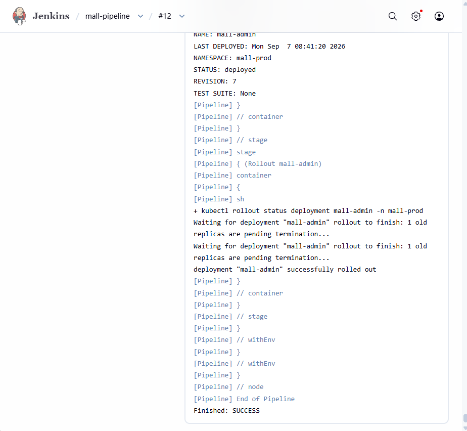
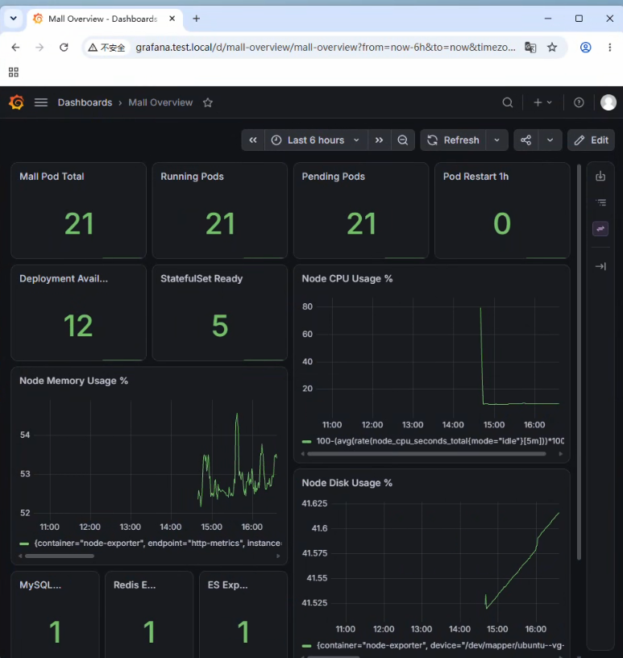

# Mall 云原生 DevOps 实践项目

> 基于开源 Mall 电商系统，进行 Kubernetes、DevOps、监控、日志与 CI/CD 的容器化与云原生实践。

[]()
[]()
[]()
[]()
[]()
[]()
[]()
[]()

---

## 一、项目简介

本项目基于开源 Mall 电商业务系统，在单节点 Kubernetes 环境中进行云原生与 DevOps 实践。

业务代码来源于开源 Mall 项目，本人在此基础上主要负责：

* Docker 容器化
* Kubernetes 部署与生产化配置
* ConfigMap / Secret 管理
* Health Check / Startup / Readiness / Liveness Probe
* Resource Requests / Limits
* HPA 自动扩缩容
* PersistentVolume / PVC / StorageClass
* Prometheus + Grafana 监控
* Elasticsearch + Logstash + Kibana 日志体系
* Harbor 私有镜像仓库
* Jenkins Pipeline
* Kubernetes Dynamic Agent
* Jenkins Kubernetes RBAC
* Helm Chart
* Helm CD
* GitHub → Jenkins → Harbor → Kubernetes CI/CD
* Kubernetes / Docker / Logstash / Elasticsearch 等组件的故障排查

项目重点不是业务功能开发，而是围绕一个真实业务系统完成完整的云原生运维与 DevOps 实践。

---

# 二、项目架构

## 2.1 整体架构


整体架构：

```text
                        GitHub
                          │
                          ▼
                       Jenkins
                          │
                  Kubernetes Agent
                          │
           ┌──────────────┴──────────────┐
           │                             │
        Maven Build                Docker Build
           │                             │
           └──────────────┬──────────────┘
                          ▼
                        Harbor
                          │
                          ▼
                         Helm
                          │
                          ▼
                    Kubernetes
                          │
        ┌─────────────────┼─────────────────┐
        │                 │                 │
      Mall             Monitoring         Logging
        │                 │                 │
        │          Prometheus/Grafana       │
        │                                   │
        └────────────── Logstash ───────────┘
                              │
                              ▼
                        Elasticsearch
                              │
                              ▼
                            Kibana
```

---

# 三、技术栈

| 分类       | 技术                                |
| -------- | --------------------------------- |
| 操作系统     | Ubuntu 24.04                      |
| 容器       | Docker                            |
| 容器运行时    | containerd                        |
| 编排       | Kubernetes                        |
| CNI      | Calico                            |
| 包管理      | Helm                              |
| 镜像仓库     | Harbor                            |
| CI/CD    | Jenkins                           |
| CI Agent | Kubernetes Dynamic Agent          |
| Java 构建  | Maven                             |
| 监控       | Prometheus + Grafana              |
| 日志       | Elasticsearch + Logstash + Kibana |
| 配置管理     | ConfigMap / Secret                |
| 自动扩缩容    | HPA                               |
| 存储       | PVC / StorageClass                |

---

# 四、项目目录

```text
mall/
├── docker/
│   ├── mall-admin/
│   ├── mall-portal/
│   └── mall-search/
│
├── mall-admin/
├── mall-portal/
├── mall-search/
├── mall-common/
├── mall-mbg/
├── mall-security/
├── mall-demo/
│
├── mall-helm/
│   └── mall-admin/
│       ├── Chart.yaml
│       ├── values.yaml
│       └── templates/
│
├── Jenkinsfile
│
└── document/
```

---

# 五、Kubernetes 部署

Mall 应用部署在：

```text
Namespace: mall-prod
```

主要使用：

```text
Deployment
Service
ConfigMap
Secret
HPA
PVC
ServiceMonitor
```

例如 mall-admin：

```text
Deployment
   │
   ├── ConfigMap
   ├── Secret
   ├── HPA
   └── Service
          │
          ▼
         Pod
```

---

# 六、健康检查

mall-admin 配置：

```text
Startup Probe
Readiness Probe
Liveness Probe
```

用途：

```text
Startup
→ 判断应用是否完成启动

Readiness
→ 判断 Pod 是否可以接收流量

Liveness
→ 判断应用是否已经异常
```

通过 Kubernetes Probe 避免应用启动未完成时提前接收流量，同时让异常 Pod 能够被 Kubernetes 发现。

---

# 七、资源限制与 HPA

mall-admin 配置：

```yaml
resources:
  requests:
    cpu: 250m
    memory: 512Mi
  limits:
    cpu: "1"
    memory: 1Gi
```

HPA：

```text
Min Replicas: 1
Max Replicas: 3
CPU Target: 70%
```

同时配置缩容稳定窗口，降低短时间 CPU 波动造成的频繁扩缩容。

---

# 八、监控

使用：

```text
Prometheus
Grafana
Alertmanager
```

应用通过：

```text
ServiceMonitor
```

暴露 Prometheus 指标。

mall-admin 使用：

```text
/actuator/prometheus
```

进行指标采集。

同时对：

```text
Kubernetes
Elasticsearch
Logstash
```

进行监控。

---

# 九、日志系统

当前已经完成应用日志链路：

```text
Mall Application
       │
       │ TCP 4560~4563
       ▼
    Logstash
       │
       ▼
Elasticsearch
       │
       ▼
     Kibana
```

Logstash 根据日志类型区分：

```text
4560 → debug
4561 → error
4562 → business
4563 → record
```

Elasticsearch 索引：

```text
mall-log-debug-YYYY.MM.dd
mall-log-error-YYYY.MM.dd
mall-log-business-YYYY.MM.dd
mall-log-record-YYYY.MM.dd
```

Kibana 使用：

```text
mall-log-*
```

进行日志检索。

当前已经验证：

```text
Discover
→ service
→ type
→ level
→ class
→ message
```

等字段可以进行过滤查询。

---

# 十、CI/CD

## 10.1 CI/CD 流程

```text
Developer
    │
    │ git push
    ▼
GitHub
    │
    ▼
Jenkins
    │
    ▼
Kubernetes Dynamic Agent
    │
    ▼
Maven Build
    │
    ▼
Docker Build
    │
    ▼
IMAGE_TAG = BUILD_NUMBER
    │
    ▼
Harbor Push
    │
    ▼
Helm Upgrade
    │
    ▼
Kubernetes Deployment
    │
    ▼
RollingUpdate
    │
    ▼
kubectl rollout status
```

---

# 十一、Jenkins Dynamic Agent

Jenkins 使用 Kubernetes Plugin 动态创建 Agent Pod。

Agent Pod：

```text
jenkins-agent
├── jnlp
└── maven
```

其中：

```text
jnlp
→ Jenkins Agent 通信

maven
→ Maven / Docker / kubectl / Helm
```

自定义 Agent 镜像中包含：

```text
Java 17
Maven 3.9.x
Docker CLI
kubectl
Helm
```

同时挂载：

```text
/var/run/docker.sock
```

使 Docker CLI 能够连接宿主机 Docker Engine。

---

# 十二、Jenkins Kubernetes RBAC

Jenkins 使用：

```text
ServiceAccount:
cicd/jenkins
```

通过：

```text
RoleBinding
    ↓
Role
```

获得 `mall-prod` 中必要的部署权限。

实际排查中曾遇到：

```text
secrets is forbidden
horizontalpodautoscalers is forbidden
servicemonitors is forbidden
```

通过补充 RBAC 权限解决。

这个过程验证了：

```text
Jenkins Agent
→ Kubernetes API
→ ServiceAccount
→ RBAC
→ Helm
```

整条权限链。

---

# 十三、Harbor

Harbor 用于保存项目 Docker 镜像。

例如：

```text
192.168.0.198/mall/mall-admin:11
192.168.0.198/mall/mall-portal:11
192.168.0.198/mall/mall-search:11
```

Jenkins 使用：

```text
harbor-credential
```

保存 Harbor 用户名和密码。

Push 流程：

```text
docker login
    ↓
docker build
    ↓
docker push
```

---

# 十四、Helm

目前：

```text
mall-admin
```

已经完成 Helm 化。

Chart：

```text
mall-helm/mall-admin
```

包含：

```text
Chart.yaml
values.yaml
templates/
```

主要模板：

```text
deployment.yaml
service.yaml
configmap.yaml
hpa.yaml
servicemonitor.yaml
```

Jenkins 使用：

```bash
helm upgrade mall-admin ./mall-helm/mall-admin \
  -n mall-prod \
  --set image.tag=${IMAGE_TAG}
```

因此：

```text
Jenkins BUILD_NUMBER
        ↓
Docker Tag
        ↓
Harbor
        ↓
Helm image.tag
        ↓
Kubernetes
```

形成完整的版本传递链。

---

# 十五、动态镜像版本

以前：

```text
mall-admin:v1
```

现在：

```text
IMAGE_TAG=${BUILD_NUMBER}
```

例如：

```text
BUILD_NUMBER=11
```

最终：

```text
mall-admin:11
```

同时 Helm：

```text
--set image.tag=11
```

最终 Kubernetes Deployment：

```text
192.168.0.198/mall/mall-admin:11
```

---

# 十六、问题排查案例

本项目不仅记录部署过程，同时记录实际遇到的问题。

## Jenkins SCM

问题：

```text
Helm Chart not found
```

原因：

```text
测试 Job 没有使用 SCM
```

以及：

```text
mall-helm
```

最初位于 Git 仓库之外。

解决：

```text
将 Helm Chart 加入 Git 仓库
```

---

## Jenkins Docker Socket

问题：

```text
Docker CLI 无法访问 Docker Engine
```

原因：

```text
/var/run/docker.sock
```

挂载路径配置错误。

解决：

```text
修正 volumeMounts
```

---

## Jenkins Kubernetes RBAC

遇到：

```text
secrets is forbidden
horizontalpodautoscalers is forbidden
servicemonitors is forbidden
```

通过：

```text
Role
RoleBinding
ServiceAccount
```

逐步补齐权限。

---

## HPA

观察到：

```text
CPU 6% / 70%
```

但短时间内副本数仍为：

```text
2
```

通过：

```bash
kubectl describe hpa
```

发现：

```text
ScaleDownStabilized
```

最终确认：

```text
HPA 缩容稳定窗口
```

导致副本不会立即下降。

---

# 十七、当前项目状态

```text
Kubernetes                  ✅
Docker                      ✅
Harbor                      ✅
Helm                        ✅
Prometheus                  ✅
Grafana                     ✅
Elasticsearch               ✅
Logstash                    ✅
Kibana                      ✅
Jenkins                     ✅
Dynamic Agent               ✅
Jenkins RBAC                ✅
CI                          ✅
CD                          ✅
mall-admin Helm             ✅
应用日志链路                ✅
Kibana 日志检索              ✅
```

当前暂未完成：

```text
Kubernetes stdout/stderr
→ Filebeat / Fluent Bit
→ Logstash
→ Elasticsearch
→ Kibana
```

以及：

```text
mall-portal Helm 化
mall-search Helm 化
```

---

# 十八、项目特点

本项目重点体现：

```text
传统运维
    ↓
Docker
    ↓
Kubernetes
    ↓
监控
    ↓
日志
    ↓
CI/CD
    ↓
云原生运维
```

核心能力：

```text
部署
监控
日志
发布
排障
自动化
```

而不是业务代码开发。

---

# 十九、项目来源说明

本项目业务代码基于开源 Mall 项目进行学习和实践。

业务源码与相关许可证、版权声明按照原项目要求保留。

本人主要负责本项目中的：

```text
容器化
Kubernetes
Helm
Jenkins
Harbor
Prometheus
Grafana
ELK
RBAC
CI/CD
监控与日志
故障排查
```

相关配置、部署文件、Dockerfile、Jenkinsfile、Helm Chart 及实践文档均为本人的学习与实践成果。

---

# 二十、项目截图

建议重点展示：

### Kubernetes


### Jenkins Pipeline



### Harbor


### Grafana



### Kibana


---

# 二十一、后续规划

```text
Filebeat / Fluent Bit
        ↓
Kubernetes stdout/stderr
        ↓
ELK 完整日志采集
```

后续还可以继续：

```text
多服务 Helm 化
多环境 values
CD 自动回滚
发布策略优化
Jenkinsfile 深度重构
```
